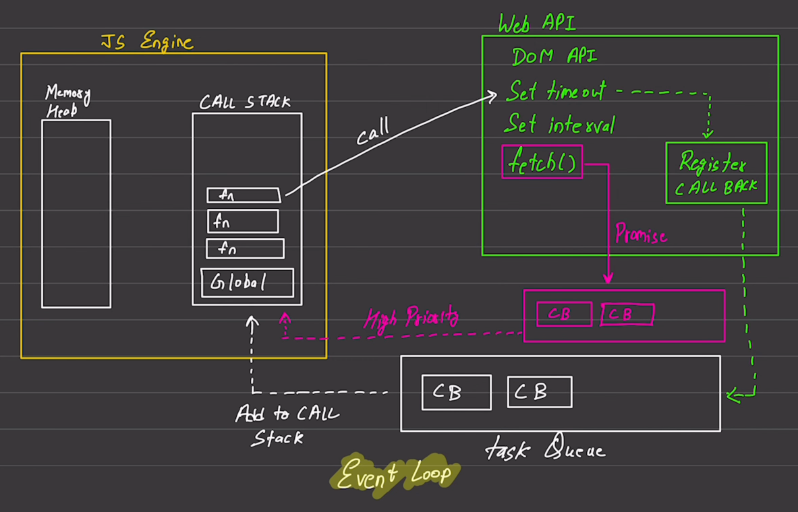

# How the JavaScript Engine Works

## 1. Overview
- JavaScript is **single-threaded** but handles concurrency via the **Event Loop**.
- Engines (e.g., V8 in Chrome, SpiderMonkey in Firefox) parse, compile, and execute JS code.

---

## 2. Key Components

### **Memory Heap**
- Stores objects, variables, and closures in unstructured memory.
- Managed by **garbage collection** (e.g., Mark-and-Sweep algorithm).

### **Call Stack**
- Tracks function execution in **LIFO** (Last-In-First-Out) order.
- Each function call creates a **stack frame** (arguments, local vars).
- Throws a "stack overflow" if recursion exceeds limits.

### **Web APIs**
- Browser-provided APIs (`setTimeout`, `fetch`, DOM events) run **asynchronously**.
- Not part of the JS engine but interact with it.

### **Callback Queues**
1. **Microtask Queue** (High Priority):
   - Holds Promise callbacks (`.then()`, `async/await`).
   - Emptied **completely** before the next Event Loop cycle.
2. **Macrotask Queue** (Lower Priority):
   - Holds `setTimeout`, `setInterval`, DOM events.

### **Event Loop**
- Continuously checks:
  1. Is the **Call Stack** empty?
  2. Are tasks in the **Microtask Queue**? → Execute all.
  3. Are tasks in the **Macrotask Queue**? → Execute one per cycle.

---

## 3. Execution Flow
1. **Synchronous Code** runs immediately on the Call Stack.
   ```js
   console.log("Hello"); // Runs first.
   ```
2. **Async Code** (e.g., `setTimeout`, Promises):
    - Delegated to Web APIs.

    - Callbacks move to Queues when resolved.

3. **Event Loop** moves callbacks to the Call Stack when empty.

---

## 4. Example
```js
console.log("Start");

setTimeout(() => console.log("Timeout"), 0);

Promise.resolve().then(() => console.log("Promise"));

console.log("End");
```

Output:
```js
Start
End
Promise
Timeout
```

**Why?**
- Sync code runs first.

- Microtasks (Promises) > Macrotasks (`setTimeout`).

---

## 5.Optimizations

- **Just-In-Time (JIT) Compilation**:

    - **Interpreter**: Quick execution (bytecode).

    - **Optimizing Compiler** (e.g., TurboFan in V8): Recompiles "hot" code for speed.

---

## Garbage Collection
- **Mark-and-Sweep**: Identifies and removes unreachable objects from the Heap.

---

## JavaScript Engine Summary

| Component        | Description                                                                 |
|-----------------|-----------------------------------------------------------------------------|
| **Call Stack**  | Tracks synchronous function execution (LIFO order). Throws "stack overflow" if limits exceeded. |
| **Memory Heap** | Stores objects/variables dynamically. Garbage collected (Mark-and-Sweep).   |
| **Web APIs**    | Browser-provided async APIs (`setTimeout`, `fetch`, DOM events).            |
| **Microtask Queue** | High-priority queue for Promise callbacks (`.then()`, `async/await`). Emptied completely before next Event Loop cycle. |
| **Macrotask Queue** | Lower-priority queue for `setTimeout`, `setInterval`, DOM events. One task per Event Loop cycle. |
| **Event Loop**  | Checks: 1) Is Call Stack empty? → 2) Execute all Microtasks → 3) Execute one Macrotask. |
| **JIT Compilation** | Combines interpreter (fast execution) + optimizing compiler (e.g., TurboFan in V8 for hot code). |

