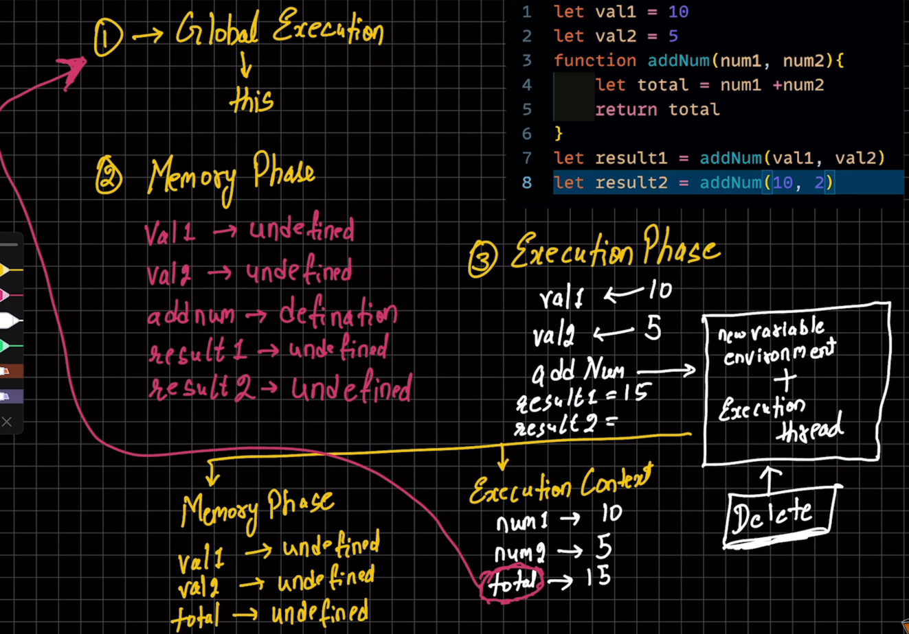

# JS - Quick Notes

## Declarations
- `const` → Cannot be reassigned.  
- `let` → Can be reassigned.  
- `var` → ❌ Avoid (scope issues), function-scoped (not block-scoped). Variables declared with `var` inside `if`, `for`, etc. are accessible outside that block.  
- Implicit declaration (`accountCity = "Pune";`) is unsafe.

## Undefined Variables
- Declaring without value → `undefined`.

## Logging
- `console.table([var1, var2, ...]);` → Displays values in table.

### Best Practices ✅  
- Use `const` & `let`, avoid `var`.  
- Always declare before using.  
- Don't modify `const`.  
## **Strict Mode**  
- `"use strict";` → Ensures modern JS behavior.  

## **Data Types**  
1. **Primitive Types**  
   (call by value)
   - `number` → Up to **2⁵³**  
   - `bigint` → Large integers  
   - `string` → `"text"`  
   - `boolean` → `true / false`  
   - `null` → Standalone value  
   - `undefined` → Variable declared but not assigned  
   - `symbol` → Unique identifier  

2. **Non-Primitive Type**  
   (call by reference)
   - `object` → Collection of key-value pairs  

## **Type Checking**  
```js
console.log(typeof "Rugved"); // string
console.log(typeof undefined); // undefined
console.log(typeof null); // object
```
## Type Conversion  

### **To Number (`Number()`)**  
| Input Value  | Converted Number |
|-------------|----------------|
| `"33"`      | `33`           |
| `"33abc"`   | `NaN`          |
| `null`      | `0`            |
| `undefined` | `NaN`          |
| `true`      | `1`            |
| `"rugved"`  | `NaN`          |

```js
let score = "rugved";
let valueInNumber = Number(score);
console.log(typeof valueInNumber); // number
console.log(valueInNumber); // NaN
```
### **To Boolean (Boolean())**
| Input Value       | Converted Boolean |
|-------------------|-------------------|
| `1`               | `true`            |
| `"rugved"`        | `true`            |
| `""` (empty)      | `false`           |
| `null`            | `false`           |

```js
let isLoggedIn = null;
let booleanisLoggedIn = Boolean(isLoggedIn);
console.log(booleanisLoggedIn); // false
```

### **To String (String())**
```js
let someNumber = 33;
let stringNumber = String(someNumber);
console.log(stringNumber); // "33"
console.log(typeof stringNumber); // string
```

## JavaScript Operators  

### **1. Unary Operators**  
- `-value` → Negates the value.  
- `+value` → Converts to a number.  

```js
let value = 3;
let negValue = -value;
console.log(negValue); // -3

console.log(+true);  // 1
console.log(+"");    // 0
```
### **2. String Concatenation (`+`)**  
- When adding a **string** and a **number**, the result is **a string**.  
- Order affects the result.  
```js
let str1 = "hello";
let str2 = " Rugved";
let str3 = str1 + str2; 
console.log(str3); // "hello Rugved"

console.log("1" + 2);      // "12"
console.log(1 + "2");      // "12"
console.log(1 + "2" + 2);  // "122"
console.log(1 + 2 + "2");  // "32"
```

### **3. Increment Operators (`++`)**  
- `++var` (Pre-increment) → Increments first, then returns the value.  
- `var++` (Post-increment) → Returns the value first, then increments.  

## JavaScript Comparison Operators 

### **1. Equality (`==`) vs. Strict Equality (`===`)**  
- `==` allows type conversion.  
- `===` checks both **value & type**. 
```js 
console.log("2" == 2);  // true
console.log("2" === 2); // false
```
### **2. Relational Comparison (`>`, `<`, `>=`, `<=`)**  
- Converts values **to numbers** before comparing.  
```js
console.log("2" > 1);  // true
console.log("02" > 1); // true
```
### **3. `null` & `undefined` Comparisons**  
- `null == 0` → `false` (no conversion).  
- `null >= 0` → `true` (`null` converts to `0`).  
- `undefined` **only equals `null`** in `==`, otherwise, behaves as `NaN` in comparisons.  
- **Any comparison with `undefined` returns `false`**.  
```js
console.log(null > 0);  // false
console.log(null == 0); // false
console.log(null >= 0); // true

console.log(undefined == null); // true
console.log(undefined == 0);    // false
console.log(undefined > 0);     // false
console.log(undefined < 0);     // false
console.log(undefined >= 0);    // false
console.log(undefined <= 0);    // false
```

## IMP Points
- JavaScript is a dynamic language and not static, which means that variables can hold values of different types during runtime. Unlike languages such as Typescript or Java, you don't need to declare the data type of a variable explicitly.

## JavaScript Array Notes

- **Creating Arrays:**
  - **Literal:** `const arr = [1, 2, 3, 4, 5];`
  - **Constructor (Not recommended):** `const arr1 = new Array(1, 2, 3, 4, 5);`
  - Arrays are objects, resizable, and copying an array creates a shallow copy (copies reference, not deep values).

- **Common Array Methods:**
  - **Adding/Removing:**
    - `push("value")` – Add to the end.
    - `pop()` – Remove from the end.
    - `unshift("value")` – Add to the beginning.
    - `shift()` – Remove from the beginning.
  - **Searching/Indexing:**
    - `includes("value")` – Check existence.
    - `indexOf("value")` – Get index.
  - **Transforming:**
    - `reverse()` – Reverse array.
    - `sort()` – Sort array.
    - `splice(start, count)` – Remove elements (modifies original).
    - `slice(start, end)` – Get a sub-array (does not modify original).
    - `join(separator)` – Convert array to string with given separator.
    
- **Array Merging:**
  - Using `concat`:  
    ```js
    const allHeros = marvel_heros.concat(dc_heros);
    ```
  - Using Spread Operator:
    ```js
    const all_new_heros = [...marvel_heros, ...dc_heros];
    ```

- **Flattening Arrays:**
  - `flat(depth)` – Flattens nested arrays to specified depth:
    ```js
    const flatArray = another_arr.flat(Infinity);
    ```

- **Utility Methods:**
  - `Array.isArray(value)` – Checks if a value is an array.
  - `Array.from(iterable)` – Converts an iterable (e.g., string) to an array.
  - `Array.of(...values)` – Creates an array from a set of values.


## JavaScript Objects 

### Singleton vs Object Literal
- **Singleton:** Created using a **constructor function**.
- **Object Literal:** `{}` does not create a singleton.

### Symbols in Objects
```javascript
const mySymbol = Symbol("mySymbol");
const obj1 = { 
  name: "Rugved", 
  age: 23, 
  isMarried: false, 
  [mySymbol]: "mySymbol" 
};
console.log(obj1[mySymbol]); // Accessing symbol property
console.log(typeof mySymbol); // "symbol"
```
## Object Freezing
```javascript
Object.freeze(obj1); // prevents modifications
```

## Object Methods
```javascript
obj1.greeting = function() {
    console.log("Hello JS user");
};
obj1.greetingTwo = function() {
    console.log(`Hello JS user, ${this.name}`); // Template Literals (``) instead of "" or ''. Allows variable interpolation: ${this.name}.
};
```

## Creating Objects
### Using Object Literal
```javascript
const tinderUser = { 
  id: 1234567890, 
  name: "Rugved", 
  isLoggedIn: true 
};
```
### Nested Object Access
```javascript
const regularUser = {
    email: "some@gmail.com",
    fullname: { 
      userfullname: { 
        firstname: "Rugved", 
        lastname: "J" 
      } 
    }
};
console.log(regularUser.fullname.userfullname.firstname); // "Rugved"
```

### Merging Objects
```javascript
const obj4 = Object.assign(obj1, obj2); // Modifies obj1
const obj5 = { ...obj1, ...obj2 }; // Creates a new object
console.log(obj5 === obj4); // false (different memory references)
```

### Object Methods
```javascript
console.log(Object.keys(tinderUser)); // ["id", "name", "isLoggedIn"]
console.log(Object.values(tinderUser)); // [1234567890, "Rugved", true]
console.log(Object.entries(tinderUser)); // [["id", 1234567890], ["name", "Rugved"], ["isLoggedIn", true]]
console.log(tinderUser.hasOwnProperty("id")); // true
```

### Array of Objects
```javascript
const users = [
    { id: 1, email: "xyz@gmail.com" },
    { id: 2, email: "dgr@gmail.com" },
    { id: 3, email: "f34@gmail.com" }
];
console.log(users[1].email); // "dgr@gmail.com"
```
### Destructuring
```javascript
const course = {
    courseName: "Javascript",
    coursePrice: 999,
    courseInstructor: "Rugved",
}

// course.courseInstructor
const {courseInstructor: ci} = course // destructuring means to extract the value of the key and assign it to the variable name
// courseInstructor is the key and ci is the variable name
console.log(ci); // Rugved
```

### Key Takeaways
   - Objects are reference types.

   - Spread `(...)` creates a new object; `Object.assign()` modifies existing objects.

   - Objects can have functions as properties.

   - Use `Object.keys()`, `Object.values()`, and `Object.entries()` to extract object data.

   - Use `Object.freeze()` to prevent modifications.


## JavaScript Functions 

### Function Basics
- **Function declaration**
```js
function sayMyName() {
    console.log("H");
    console.log("I");
}
```

- **Function Invocation** 
```js
sayMyName();
```

### Returning Values
```js
function addTwoNumbers(num1, num2) {
    return num1 + num2;
}
const result = addTwoNumbers(3, 5);
```

### Default Parameters
```js
function loginUserMessage(username = "sam") {
    return `${username} just logged in`;
}
```

### Rest Parameters
```js
function calculateCartPrice(val1, val2, ...prices) {
    return prices;
}
```
### Passing Objects to Functions
```js
function handleObject(obj) {
    console.log(`Username is ${obj.username} and price is ${obj.price}`);
}
```

### Passing Arrays to Functions
```js
function returnSecondValue(arr) {
    return arr[1];
}
```
### Key Takeaways
  - Use default parameters to handle missing values.

  - Rest parameters `(...)` allow handling multiple arguments.

  - Pass objects and arrays to functions for structured data manipulation.


## JavaScript Scope & Hoisting 

### 🔹 Block Scope with `let` and `const`
```js
let a = 300;
if (true) {
  let a = 10; // Block-scoped
  const b = 20;
}
console.log(a); // 300 (outer 'a')
// b is not accessible outside the block
```
### 🔹 Function Scope & Closure
```js
function one() {
  const username = "hitesh";
  function two() {
    const website = "youtube";
    console.log(username); // Closure: inner can access outer
  }
  two();
}
```
### 🔹Nested If Scope
```js
if (true) {
  const username = "hitesh";
  if (username === "hitesh") {
    const website = "youtube";
    console.log(username + website);
  }
  // website not accessible here
}
```
### Hoisting 
  - Hoisting is JavaScript's behavior of moving declarations to the top of their scope.
  #### ✅ Function Declaration – Hoisted
  ```js
    console.log(addone(5));
    function addone(num) {
    return num + 1;
  }
  ```
  #### ❌ Function Expression – Not Hoisted
  ```js
    console.log(addTwo(5)); // ❌ Error
    const addTwo = function(num) {
    return num + 2;
  };
  ```

## Scope Difference: Browser vs Node.js

- In the **Browser Console**:
  - `var` variables become part of the global `window` object.
  - Code runs directly in global scope.

- In **Node.js**:
  - Each file is wrapped in a function scope by default.
  - `var`, `let`, `const` don't attach to the `global` object.
  - This prevents polluting the global environment.

✅ Use `let`/`const` for predictable scoping in both environments.

## JavaScript `this` & Arrow Functions
### 🏠 Object & `this`  
```js
const user = {
    username: "hitesh",
    price: 999,
    welcomeMessage: function() {
        console.log(`${this.username}, welcome to website`);
        console.log(this);
    }
};
console.log(user);
```
  - `this` inside an object method refers to the current object.

  - `user.welcomeMessage()` → `this` points to `user`.

### 🌍 `this` in Global Scope
  ```js
  console.log(this);
  ```
  - In Browser → `this` refers to `window`.

  - In Node.js → `this` is `{}` (empty object in module scope).

### ❌ this inside a Regular Function
```js
function chai() {
    let username = "hitesh";
    console.log(this.username); // ❌ undefined
}
chai();
```
- `this` inside a regular function does NOT refer to the outer scope.

- Instead, it refers to global object (`window` in browsers, `global` in Node.js), but primitive variables are NOT attached.

### 🏹 this in Arrow Functions
```js
const chai = () => {
    let username = "hitesh";
    console.log(this);
};
chai();
```
- Arrow functions do not bind `this`.

- `this` inside an arrow function refers to the parent scope (lexical `this`).

### 🎯 Arrow Function Short Syntax
```js
const addTwo = (num1, num2) => num1 + num2;
const addTwo2 = (num1, num2) => (num1 + num2);
const addTwo3 = (num1, num2) => ({ username: "hitesh" });

console.log(addTwo(3, 4)); // 7
console.log(addTwo3()); // { username: "hitesh" }
```
- ✅ No `return` needed if using implicit return (`() => expression`).

- ✅ To return an object, wrap it inside `()` → `({})`.

## 🚀 Immediately Invoked Function Expressions (IIFE)

### 🔹 What is IIFE?  
- A function that **executes immediately** after its definition.  
- Helps **avoid global scope pollution**.
- ⚠️ Important: Always end an IIFE with a `;` to avoid issues with multiple IIFEs.

### 🔹 Syntax & Example  
```js
// Named IIFE
(function chai() {
    console.log(`DB CONNECTED`);
})();

// Arrow Function IIFE with Parameter
((name) => {
    console.log(`DB CONNECTED TWO ${name}`);
})('hitesh');
```

## JavaScript Execution Context & Call Stack

### Overview
- JavaScript is **single-threaded**.
- When a JS file starts executing, the **Global Execution Context (GEC)** is created.
- The `this` keyword refers to the global context.
- There are three types of execution contexts:
  1. **Global Execution Context**
  2. **Function Execution Context** – created when a function is called.
  3. **Eval Execution Context** – rarely used, created by `eval()` function.

### Two Phases of JS Execution

#### 1. **Creation Phase (Memory Allocation Phase)**
- All **variables and functions are allocated memory**.
- This phase is also called the **first cycle**.
- Only references are stored, not actual values.

#### 2. **Execution Phase**
- Actual **code is executed**.
- When a function is called, a **new execution context** is created.
- Each function execution context has:
  - **Variable Environment**
  - **Execution Thread**
- Function execution context also goes through:
  - **Memory phase**
  - **Execution phase**
- Once done, the context is **destroyed**.

### Call Stack

- The **Call Stack** manages execution contexts.
- It starts with the **Global Execution Context**.
- When a function is invoked:
  - Its execution context is **pushed** onto the stack.
- When the function finishes:
  - The context is **popped** from the stack.

### Summary

- JS runs in a **single thread** using a **call stack**.
- Execution contexts are created for each function call.
- Each context goes through **creation and execution phases**.
- The stack ensures the correct **order of execution**.




## Falsy/Truthy, Nullish, Ternary

### Falsy Values
Values treated as `false` in boolean context:
- `false`
- `0`, `-0`
- `BigInt(0n)`
- `""` (empty string)
- `null`
- `undefined`
- `NaN`

### Truthy Values
Anything not falsy, e.g.:
- `"0"`, `" "` (non-empty strings)
- `'false'`
- `[]` (empty array)
- `{}` (empty object)
- `function() {}`

### Nullish Coalescing Operator (`??`)
Returns the right-hand value only if the left-hand value is `null` or `undefined`.
```js
val1 = null ?? 10       // → 10
val1 = undefined ?? 15  // → 15
val1 = 0 ?? 20          // → 0 (0 is not null/undefined)
```

### Ternary Operator
```js
condition ? doIfTrue : doIfFalse;
```

## JavaScript Loops & Iteration

### `for` Loop
- Basic iteration with index.
- Can be nested (`outer` & `inner` loops).
```js
for (let i = 0; i <= 10; i++) {}
```
### `break` & `continue`
  - `break`: exits the loop.

  - `continue`: skips current iteration.

### `while` Loop
- Runs while condition is true.
```js
while (condition) {}
```

### `do...while` Loop
- Executes at least once.
```js
do {} while (condition);
```

### `for...of`
- Iterates over arrays, strings, maps.
```js
for (const item of iterable) {}
```

### `for...in`
- Iterates over keys of objects/arrays.
```js
for (const key in object) {}
```

### Map Iteration
- Use `for...of` with destructuring.
```js
for (const [key, value] of map) {}
```

### forEach
- Used to **iterate** over items.
- Does **not return a new array**.
- Commonly used for side effects like `console.log()` or `push()`.
```js
arr.forEach((item, index, array) => {})
```
#### Example: Array of Objects
```js
myCoding.forEach(item => {
  console.log(item.languageName);
});
```
  - ⚠️ for...in doesn't work on Map, use for...of instead.

### filter()
- Returns a new array with elements that pass a condition.

- Always returns elements for which the callback returns `true`.
```js
const nums = [1, 2, 3, 4, 5];
const result = nums.filter(num => num > 3); // [4, 5]
```

### map()
- Returns a new array with transformed values.

- Each item is mapped to a new value using the callback function.
```js
const nums = [1, 2, 3];
const plusTen = nums.map(num => num + 10); // [11, 12, 13]
```
### reduce()
- Reduces the array to a single value.

- Commonly used for totals, averages, etc.
```js
const nums = [1, 2, 3];
const sum = nums.reduce((acc, curr) => acc + curr, 0); // 6
```

### Summary Table
| Method    | Purpose          | Returns            | Use Case                          |
|-----------|------------------|---------------------|-----------------------------------|
| `forEach` | Iterate only     | `undefined`         | Running side effects (logs, etc.) |
| `map`     | Transform items  | New array           | Modify elements in array          |
| `filter`  | Select items     | New filtered array  | Extract matching items            |

## 🌐 DOM (Document Object Model)

### 📘 What is the DOM?
- The **DOM** is a programming interface for web documents.
- It represents the structure of an HTML document as a **tree** of objects.
- Allows JavaScript to interact with and manipulate HTML & CSS.

---

### 🧱 DOM Structure
- Everything in HTML becomes a **node** in the DOM.
  - Document → Root node
  - Elements → Element nodes
  - Text → Text nodes
  - Comments → Comment nodes

---

### 🔍 Selecting Elements

| Method | Description |
|--------|-------------|
| `getElementById(id)` | Selects an element by its ID |
| `getElementsByClassName(class)` | Selects elements by class name (HTMLCollection) |
| `getElementsByTagName(tag)` | Selects elements by tag name (HTMLCollection) |
| `querySelector(selector)` | Selects the **first** element matching a CSS selector |
| `querySelectorAll(selector)` | Selects **all** matching elements (NodeList) |

---

### ✏️ Modifying Elements

```js
element.textContent = 'Hello';    // Change text
element.innerHTML = '<b>Hi</b>';  // Change inner HTML
element.style.color = 'red';      // Change style
element.setAttribute('id', 'newId'); // Set attributes
```

---

### 🛠️ Creating & Inserting Elements

```js
let div = document.createElement('div');
div.textContent = 'New Element';
document.body.appendChild(div); // Adds at end of body
```

---

### 🗑️ Removing Elements

```js
element.remove(); // Modern way
parent.removeChild(child); // Old way
```

### 📚 Useful Terms
  - Node: A single point in the DOM tree

  - Element: HTML tag (like `<div>`, `<p>`)

  - Attribute: HTML attributes like `id`, `class`

  - Event: User actions like click, keypress, etc.
